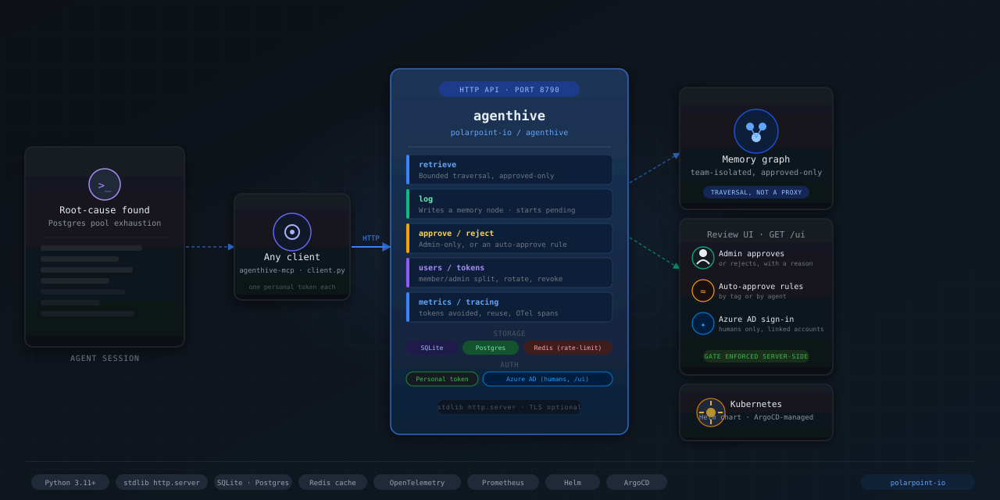
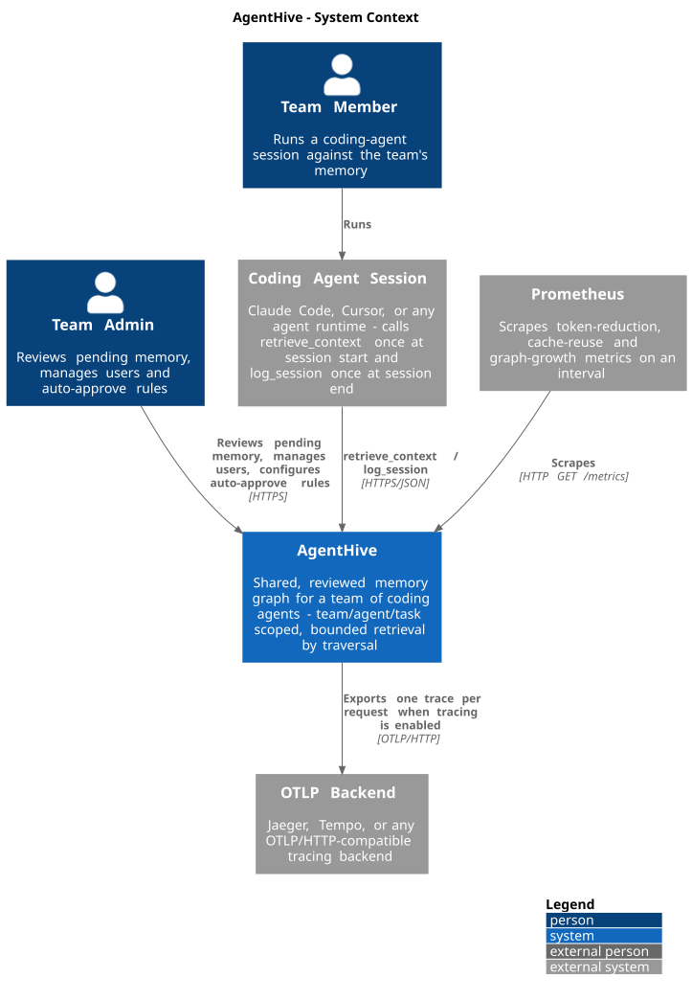
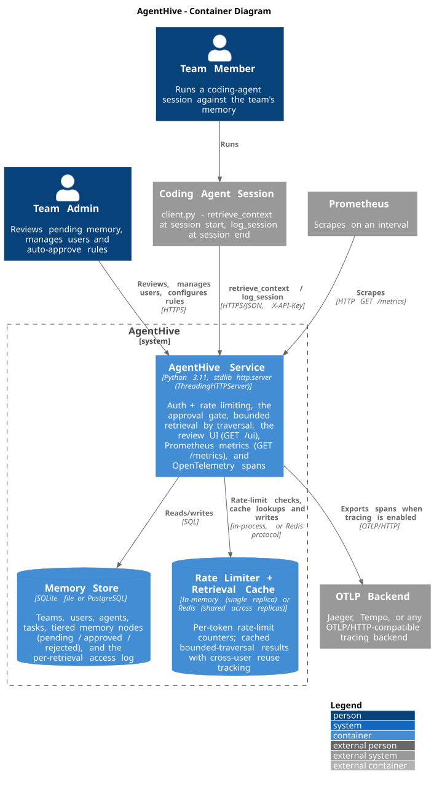

# AgentHive



A shared, reviewed memory graph for a team of coding agents: a
team/agent/task graph with retrieval-by-traversal, and deliberately no
proxy that intercepts and enriches every single LLM request. See
[`ADR.md`](ADR.md) for the full reasoning.

**Onboarding a team?** [`ONBOARDING.md`](ONBOARDING.md) is the
step-by-step walkthrough - install, create a team, add teammates, wire
up an agent, review your first memory, and watch it work. This README is
the concept/reference doc; that one is the "do this, in this order" doc.

## Architecture

A System Context view (who and what talks to AgentHive) and a Container
view (what's inside it) - C4 model, source in
[`docs/diagrams/`](docs/diagrams/) as plain PlantUML against the
[C4-PlantUML](https://github.com/plantuml-stdlib/C4-PlantUML) stdlib, so
they render with any standard PlantUML toolchain and stay diffable in a
PR.





## What it actually does

- **Guardrail:** every memory an agent writes lands as `pending` (unless
  an admin has configured an auto-approve rule for it - see below). It is
  invisible to every other agent, in every session, until an admin
  approves it.
- **Hive mind, scoped:** once approved, any user under the same team can
  retrieve it. Memory never crosses a team boundary - enforced at the
  query layer, verified in `tests/test_end_to_end.py`.
- **Per-user identity:** every call is made as a specific user's personal
  token (`admin` or `member` role), not one shared team secret. Tokens
  can be rotated or revoked individually. See `tests/test_auth.py`.
- **Auto-approve policy:** an admin can configure rules ("anything tagged
  `ci-noise`", "anything from agent X") that skip the review queue -
  useful once you know what your team actually rejects. Every
  auto-approved node still carries an audit trail (`auto_approved`,
  `rule_id`). See `tests/test_autoapprove.py`.
- **Token control, not token addition:** retrieval walks the approved
  graph outward from an anchor note (hub-cutoff traversal), returning a
  bounded neighborhood and its approximate token count. Nothing is
  injected automatically.
- **Two calls, not every call:** an agent session calls `retrieve_context`
  once at the start and `log_session` once at the end. There is no proxy
  sitting in front of your LLM traffic.
- **SQLite or Postgres:** SQLite by default (zero setup); set
  `DATABASE_URL` to a `postgresql://` URL to run against Postgres once
  you need concurrent writers at real volume. Same schema, same code
  path either way.
- **A small review UI:** `GET /ui` serves a single-page app for approving/
  rejecting pending memory, managing auto-approve rules, managing users,
  and a per-team metrics snapshot - no separate build step, no separate
  deploy.
- **Shared across replicas via Redis:** set `REDIS_URL` and the rate
  limiter and the retrieval cache both switch from in-memory (single
  replica only) to Redis-backed (shared across every replica). Required
  once you run more than one instance - see DEPLOYMENT.md.
- **Metrics that prove the pitch, not just assert it:** `GET /metrics`
  (Prometheus format) tracks tokens avoided by scoped retrieval, cache
  reuse across teammates (including *cross-user* reuse - direct evidence
  of shared, not per-agent, memory), and graph growth over time. See
  `observability/README.md` for what's actually measured and a starter
  Grafana dashboard.
- **TLS, natively or via a proxy:** set `AGENTHIVE_TLS_CERT_FILE` /
  `AGENTHIVE_TLS_KEY_FILE` to serve HTTPS directly, or terminate TLS in
  front (a reverse proxy, or the Helm chart's Ingress) as usual.
- **The whole journey, mapped:** set `OTEL_EXPORTER_OTLP_ENDPOINT` (or
  `AGENTHIVE_TRACING_CONSOLE=true` for zero infrastructure) and every
  request becomes an OpenTelemetry trace - the rate-limit check, the
  auth lookup, the cache lookup, the graph traversal, the approval gate
  itself - not just a counter that it happened. `client.py` propagates
  trace context to the server and can link a whole agent session
  (retrieve + log) into one trace with `traced_session(...)`. Off by
  default, zero cost when unset. See `tracing.py` and `ONBOARDING.md`'s
  "Watch it work" step.
- **Docker and Helm, the same shape as the rest of polarpoint-io:**
  `docker compose up` for a single host; for Kubernetes, `helm install`
  against the chart in `helm/agenthive/` (SQLite+1 replica or
  Postgres+N replicas, with Redis, Ingress/TLS, Prometheus scraping, and
  tracing all wired through chart values). Images publish to
  `ghcr.io/polarpoint-io/agenthive` and the chart to
  `oci://ghcr.io/polarpoint-io/charts` - both driven by conventional
  commits on `main` via semantic-release, the same release pipeline used
  across the org (see `.github/workflows/`). `docker compose --profile
  jaeger up` gives you a trace-browsing web UI in one command.

## Running it

```bash
python3 server.py --port 8790 --db agenthive.db
```

That's the whole deploy for SQLite. One process, one file. For Docker,
Kubernetes (Helm), Postgres, Redis, TLS, systemd, and reverse-proxy
setups, see [`DEPLOYMENT.md`](DEPLOYMENT.md) and
[`helm/agenthive/README.md`](helm/agenthive/README.md).

```bash
docker compose up -d --build          # single host, SQLite
helm install agenthive helm/agenthive # Kubernetes
```

## Setting up a team

```python
from client import TeamMemoryClient, create_team

data = create_team("http://127.0.0.1:8790", "Platform Team")
team, owner = data["team"], data["user"]
# owner["token"] is shown ONLY here - save it somewhere real, there is
# no recovery flow. It's the team's first admin user.

admin = TeamMemoryClient("http://127.0.0.1:8790", owner["token"], team["id"])

# Give each agent-running teammate their own token, don't share the admin's:
engineer = admin.create_user("alice", role="member")
# engineer["token"] -> hand this to Alice's agent config, not the admin token

agent = admin.create_agent("bug-fix engineer", description="fixes prod incidents")
task = admin.create_task("Q4 incident backlog")
```

## What an agent session actually calls

At the start of a session (in a `CLAUDE.md` / `.cursor/rules` instruction):

```python
from client import TeamMemoryClient

client = TeamMemoryClient("http://127.0.0.1:8790", engineer_token, team_id)
context = client.retrieve_context("Postgres connection pool exhaustion", hops=2)
# context["neighborhood"] -> bounded list of approved memory nodes
# context["approx_tokens"] -> what this actually costs before you send it
```

At the end of a session:

```python
client.log_session(
    title="Postgres connection pool exhaustion",
    body="Root cause: pgbouncer max_client_conn too low. Fix: raised to 400.",
    agent_id=agent["id"],
    task_id=task["id"],
    tags=["postgres", "incident"],
    links=["Pgbouncer Runbook"],
)
```

This writes a node that starts `pending`, unless it matches an
auto-approve rule.

## Hooking up Cursor / Claude Code via MCP

The instruction-block approach above works anywhere, but Cursor and Claude
Code can also discover `retrieve_context` and `log_session` as native
tools over [MCP](https://modelcontextprotocol.io) - no `CLAUDE.md` /
`.cursor/rules` prose needed, the agent just sees them in its tool list.

`mcp_server.py` is a thin local wrapper: it runs on your own machine (your
IDE spawns it as a subprocess, same as any other MCP server), reads
`AGENTHIVE_URL` / `AGENTHIVE_TOKEN` / `AGENTHIVE_TEAM_ID` from its
environment, and passes every call straight through to `client.py` - it
holds no state and makes no decisions of its own, so you still only get
exactly what your token already lets you do (see ADR.md's "Authentication"
section). It needs one extra package that the deployed service itself
never installs:

```bash
pip install -r requirements-mcp.txt
```

Then point your IDE at it. Claude Code (`.mcp.json` in the repo root, or
`claude mcp add`):

```json
{
  "mcpServers": {
    "agenthive": {
      "command": "python3",
      "args": ["/absolute/path/to/agenthive/mcp_server.py"],
      "env": {
        "AGENTHIVE_URL": "http://127.0.0.1:8790",
        "AGENTHIVE_TOKEN": "<your personal token>",
        "AGENTHIVE_TEAM_ID": "<team id>"
      }
    }
  }
}
```

Cursor (`.cursor/mcp.json`) uses the identical shape. Either way, use your
own token from Step 3 above, not the admin's - the MCP server enforces
nothing itself, so whatever your token can do (member or admin) is what
it can do here too. Once it's picked up, tell the agent (in a
`CLAUDE.md` / `.cursor/rules` line, or just once in conversation) to call
`retrieve_context` before starting work and `log_session` once it's done -
the tools existing doesn't make an agent call them unprompted.

## Reviewing pending memory

Open `http://127.0.0.1:8790/ui` in a browser, enter the base URL, team
ID, and an **admin** token, and approve/reject from there - or script it:

```python
pending = admin.list_pending()
for node in pending["pending"]:
    print(node["id"], node["title"], node["body"][:80])

admin.approve(node_id)
# or
admin.reject(node_id, reason="not ready, needs discussion")
```

## Auto-approve rules (admin only)

```python
admin.create_auto_approve_rule(match_tag="ci-noise")
# or: admin.create_auto_approve_rule(match_agent_id=agent["id"])

admin.list_auto_approve_rules()
admin.delete_auto_approve_rule(rule_id)
```

Any memory node written afterwards whose tags include `ci-noise` (or
whose `agent_id` matches) is approved immediately - it never enters the
pending queue.

## Managing users

```python
admin.create_user("bob", role="member")   # returns a token, shown once
admin.list_users()
admin.rotate_token(user_id)               # invalidates the old token
admin.revoke_user(user_id)                # locks the user out immediately
```

A `member` can log and retrieve memory, and manage agents/tasks. Only an
`admin` can review pending memory, manage users, or configure
auto-approve rules. Any user can rotate their own token.

## Azure AD sign-in (humans only)

Agents keep using their personal tokens exactly as above. Humans using the
review UI (`GET /ui`) can *also* sign in with Azure AD (Microsoft Entra
ID), once an admin sets four environment variables (see `.env.example`):

```bash
AGENTHIVE_AZURE_TENANT_ID=...
AGENTHIVE_AZURE_CLIENT_ID=...
AGENTHIVE_AZURE_CLIENT_SECRET=...
AGENTHIVE_AZURE_REDIRECT_URI=https://agenthive.yourcompany.com/auth/azure/callback
```

That last one must exactly match a Redirect URI registered on the Azure
AD App Registration. With all four set, `GET /ui` shows a "Sign in with
Microsoft" button.

Signing in with Microsoft never creates an AgentHive account by itself -
there is no auto-provisioning (see `ADR.md`'s "Authentication" section
for why). The first time someone signs in, they'll see their own Azure
object id and a message that no AgentHive user is linked yet; an admin
links it from the Users card (or `POST
/teams/{team_id}/users/{user_id}/link-azure {"azure_oid": "..."}`), and
from then on that person can sign in with Microsoft and lands as that
user, with a session that expires automatically
(`AGENTHIVE_AZURE_SESSION_TTL_SECONDS`, default 1 hour) rather than
living forever like an agent's token.

## Testing

```bash
pip install -r requirements.txt -r requirements-mcp.txt
pytest
```

The suite spins up a real `server.py` per test ("test against a running
server, not mocks"), against an
isolated SQLite file by default. Set `DATABASE_URL` to also exercise the
Postgres backend, and `REDIS_URL_FOR_TESTS` for the Redis-backed rate
limiter/cache tests (CI runs all three - see `.github/workflows/ci.yml`,
which also `helm lint`s and `helm template`s the chart).

`tests/test_retrieval_unit.py` proves the traversal algorithm in
isolation. `test_end_to_end.py`, `test_auth.py`, `test_autoapprove.py`,
`test_rate_limit.py`, `test_metrics_and_cache.py`, `test_redis_backends.py`,
`test_tls.py`, `test_tracing.py`, `test_oidc.py` and `test_mcp_server.py`
prove the properties
that matter for the design: the approval gate actually gates, team
isolation actually isolates, roles are enforced, revoked/rotated tokens
actually stop working, auto-approve rules actually match, the rate
limiter actually limits (in-memory *and* shared via Redis across two real
processes), a cache hit from a different user is counted as cross-user
reuse, the server actually serves HTTPS when TLS is configured, the write
-> review -> retrieve journey actually produces the right spans with a
shared trace id across a propagated call (using the zero-infrastructure
console exporter; real OTLP export to Jaeger was verified manually
during development - see `ADR.md`'s "Reliability and observability"
section), Azure AD sign-in actually mints a working session only for
a linked user, against a real locally-generated RSA keypair and JWKS
endpoint rather than a mocked signature check, and `mcp_server.py`
actually round-trips a write through approval to retrieval when driven by
a real `mcp.ClientSession` over real stdio, not a mocked transport
(skipped automatically if `requirements-mcp.txt` isn't installed).

## Metrics: does this actually reduce token usage and get reused?

`GET /metrics` and the review UI's Metrics tab exist to answer that with
numbers instead of a claim:

```bash
curl http://127.0.0.1:8790/metrics | grep agenthive_tokens_avoided_total
curl -H "X-API-Key: $ADMIN_TOKEN" http://127.0.0.1:8790/teams/$TEAM_ID/metrics/summary
```

Import `observability/grafana-dashboard.json` into Grafana for the
trend view - tokens avoided over time, cache hit rate, cross-teammate
reuse, and graph growth. Read `observability/README.md` first: it's
explicit about what these numbers do and don't claim (this service
never calls an LLM, so "tokens avoided" means "not sent because
retrieval was scoped," not a real billing figure).

## Tracing: what actually happened for THIS call

Metrics answer "in aggregate, over time." Tracing answers "for the
retrieve_context call my agent just made, where did the 40ms go, and
what did the server actually do?" Turn it on with zero infrastructure
first:

```bash
AGENTHIVE_TRACING_CONSOLE=true python3 server.py --port 8790
```

Do a write + retrieve (see "What an agent session actually calls"
above) and watch the terminal - each finished span prints as one line
of JSON: the rate-limit check, the auth lookup, the cache lookup (hit or
miss), the graph traversal, the approval-gate write. For the real thing,
point it at Jaeger - a one-command trace-browsing web UI:

```bash
docker compose --profile jaeger up -d
export OTEL_EXPORTER_OTLP_ENDPOINT=http://localhost:4318
python3 server.py --port 8790
open http://localhost:16686
```

Wrap `retrieve_context` + `log_session` in `with client.traced_session():`
to see one agent session's whole journey as a single connected trace
(context propagates across the network hop via the standard W3C
`traceparent` header) instead of two separate ones. See `tracing.py`'s
docstring for the full design, and `ONBOARDING.md`'s "Watch it work"
step for a guided first look. Verified against a real Jaeger instance
during development, not just the console exporter - see `ADR.md`'s
"Reliability and observability" section.

## Token expiry and trace sampling

See `ADR.md`'s "Authentication" and "Reliability and observability"
sections:

- **`AGENTHIVE_TOKEN_TTL_SECONDS`** (default `0`, never expires - the
  original behavior). Set it and every token minted or rotated from then
  on expires automatically; an expired token fails auth exactly like a
  revoked one. Existing tokens keep working until next rotated - turning
  this on doesn't retroactively lock anyone out.
- **`AGENTHIVE_TRACE_SAMPLE_RATIO`** (default `1.0` - trace everything,
  same as before). Head-based sampling: the decision is made once per
  trace, and every child span inherits it, so a sampled-in request is
  never left with a partial trace.

See `DEPLOYMENT.md`'s environment variable table for both.

## What's deliberately not here yet

See `ADR.md`'s "Open questions" section in full, but the short version:

- **No L1 -> L2 -> L3 promotion worker.** Everything sits at whatever tier
  it was written at. Building an LLM-driven summarization pass against
  limited real usage data is still premature.
- **No LLM-request proxy.** This was a deliberate choice, not a missing
  feature - see `ADR.md`'s "Why not build an LLM-request proxy" section.
  Closing this "gap" would mean reversing the reason AgentHive is shaped
  the way it is, not finishing it.

The Redis rate limiter is also still a fixed window, not a true sliding
window - see `DEPLOYMENT.md`'s "Known limitations". TLS, multi-node
rate-limit/cache sharing, token expiry, and trace sampling were all
flagged as gaps at some point and are closed now - see `ADR.md`.

## Files

- `config.py` - environment-driven settings (storage, auth, rate limits, cache, TLS, logging, metrics)
- `auth.py` - token generation/hashing and the rate limiter (in-memory or Redis-backed)
- `cache.py` - the retrieval cache (in-memory or Redis-backed)
- `metrics.py` - Prometheus metrics, served at `GET /metrics`
- `tracing.py` - OpenTelemetry distributed tracing, off by default (see `ONBOARDING.md`/`OTEL_EXPORTER_OTLP_ENDPOINT`/`AGENTHIVE_TRACING_CONSOLE`)
- `oidc.py` - Azure AD (Microsoft Entra ID) login for the review UI, humans only - PKCE, JWKS verification, off unless `AGENTHIVE_AZURE_*` is set
- `db.py` - storage layer: SQLite and Postgres backends behind one schema, plus the access log behind reuse metrics
- `retrieval.py` - the traversal algorithm, scoped to team + approved-only
- `server.py` - the HTTP API (stdlib `http.server`) + structured logging + health checks + TLS + tracing
- `client.py` - what an agent session (or an admin script) actually calls; propagates trace context
- `mcp_server.py`, `requirements-mcp.txt` - local MCP stdio wrapper exposing `retrieve_context`/`log_session` as native tools for Cursor/Claude Code (see "Hooking up Cursor / Claude Code via MCP" above)
- `ui/index.html` - the review UI, served at `GET /ui` (approve/reject, users, auto-approve rules, metrics)
- `tests/` - pytest suite (unit + end-to-end against a real running server, incl. Redis, TLS, and tracing)
- `Dockerfile`, `docker-compose.yml` - container packaging (SQLite, Postgres, Redis, and/or Jaeger profiles)
- `helm/agenthive/` - Kubernetes Helm chart (see its own README.md)
- `.github/workflows/` - `ci.yml` (pytest against SQLite/Postgres/Redis), `chart.yml` (helm lint + render + validate), `images.yml` (build/push to GHCR), `release.yml` (semantic-release from conventional commits on `main`)
- `Makefile`, `.releaserc.json`, `commitlint.config.js`, `package.json` - the same local build/release tooling used across polarpoint-io
- `docs/diagrams/` - C4 Context/Container diagrams (PlantUML source + rendered SVG)
- `static/hero.svg` - the banner at the top of this file (`hack/build_hero.py` regenerates it)
- `observability/` - Grafana dashboard + the metrics/tracing reference
- `ONBOARDING.md` - step-by-step walkthrough for getting a real team from zero to using this
- `DEPLOYMENT.md` - Docker/Kubernetes/Postgres/Redis/TLS/tracing/systemd setup, env vars, known limitations
- `ADR.md` - why this is shaped the way it is, and what it deliberately isn't
